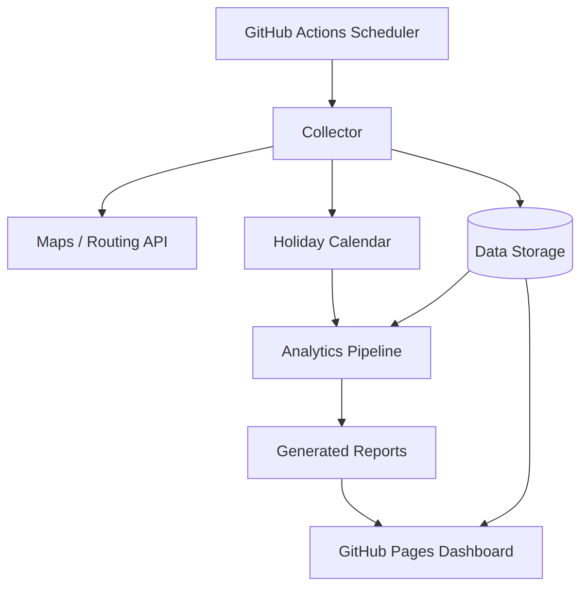

# RouteStats

RouteStats to propozycja aplikacji zbierającej i analizującej statystyki czasu dojazdu między punktem A i B w zależności od pory dnia, dnia tygodnia oraz kalendarza dni wolnych i świąt przypadających w tygodniu.

## Cel aplikacji

Aplikacja ma cyklicznie pobierać szacowany czas przejazdu dla zdefiniowanych tras, zapisywać obserwacje w repozytorium danych, a następnie prezentować statystyki pokazujące typowy, minimalny, maksymalny i percentylowy czas dojazdu dla wybranych przedziałów czasu.

Przykładowe pytania, na które aplikacja powinna odpowiadać:

- ile zwykle trwa dojazd z punktu A do B w poniedziałek między 7:00 a 8:00,
- czy piątkowe popołudnia są wolniejsze niż wtorkowe,
- jak święto wypadające w środku tygodnia wpływa na ruch,
- o której godzinie najlepiej wyruszyć, aby uniknąć największych opóźnień,
- jak zmienia się mediana i 90. percentyl czasu przejazdu w kolejnych tygodniach.

## Założenia funkcjonalne

- użytkownik definiuje jedną lub wiele tras jako pary punktów A-B,
- system pobiera czas przejazdu w regularnych interwałach, np. co 5, 10 lub 15 minut,
- każda obserwacja jest wzbogacana o cechy kalendarzowe: dzień tygodnia, godzinę, numer tygodnia, informację o weekendzie, święcie oraz dniu roboczym,
- aplikacja rozróżnia zwykłe dni robocze, weekendy, święta oraz dni nietypowe, np. święto przypadające we wtorek,
- panel raportowy prezentuje agregaty i trendy dla wybranych tras oraz zakresów dat,
- całość może działać w oparciu o GitHub bez konieczności utrzymywania własnego serwera aplikacyjnego.

## Proponowana architektura na GitHub



### 1. Repozytorium GitHub

Repozytorium pełni rolę centrum aplikacji i zawiera:

- kod kolektora danych,
- konfigurację monitorowanych tras,
- skrypty analityczne,
- definicje workflow GitHub Actions,
- dane historyczne lub metadane danych,
- wygenerowany statyczny dashboard publikowany przez GitHub Pages.

Proponowana struktura katalogów:

```text
.github/workflows/
  collect.yml          # cykliczne pobieranie danych
  aggregate.yml        # okresowe przeliczanie statystyk
  deploy-pages.yml     # publikacja dashboardu
config/
  routes.yml           # definicje tras A-B
  calendars.yml        # konfiguracja krajów/regionów świąt
data/
  raw/                 # surowe obserwacje, najlepiej partycjonowane po dacie
  processed/           # zagregowane tabele statystyczne
src/
  collector/           # klient API map i zapis obserwacji
  analytics/           # agregacje, cechy kalendarzowe, percentyle
  dashboard/           # statyczny frontend lub generator raportów
tests/
  unit/
  integration/
```

### 2. Warstwa zbierania danych

Kolektor uruchamiany przez GitHub Actions powinien:

1. odczytać listę tras z `config/routes.yml`,
2. pobrać szacowany czas przejazdu z wybranego API trasowania,
3. pobrać lub wyliczyć metadane kalendarzowe,
4. zapisać obserwację w formacie append-only,
5. opcjonalnie utworzyć Pull Request z nową porcją danych albo zapisać dane w zewnętrznym magazynie.

Potencjalne źródła czasu przejazdu warto dobierać przede wszystkim po tym, czy zwracają czas przejazdu uwzględniający bieżący albo typowy ruch drogowy. Poniższa lista zaczyna się od opcji najłatwiejszych do testów w darmowym limicie lub bez opłat za samodzielne uruchomienie. Limity i cenniki API map zmieniają się często, dlatego przed wdrożeniem należy potwierdzić aktualne warunki u dostawcy.

| Priorytet startu | Dostawca / API | Ruch drogowy | Darmowy start | Uwagi dla RouteStats |
| --- | --- | --- | --- | --- |
| 1 | TomTom Routing API / Matrix Routing API / Traffic APIs | Tak: routing z ruchem oraz osobne API ruchu dla danych bieżących i historycznych | Tak: publiczny cennik TomTom pokazuje bezpłatny miesięczny limit dla wybranych API, m.in. Routing API i Matrix Routing API | Najlepszy pierwszy kandydat do MVP: prosty klucz API, konkretne endpointy do tras i macierzy, dobry kompromis między darmowym testem a danymi o ruchu. |
| 2 | HERE Routing API | Tak: trasy mogą uwzględniać informacje o ruchu, zależnie od parametrów zapytania i planu | Tak: HERE deklaruje bezpłatną rejestrację i model pay-as-you-grow | Dobry kandydat alternatywny, szczególnie jeśli potrzebne będą profile pojazdów, większa kontrola parametrów trasy albo wdrożenie bardziej produkcyjne. |
| 3 | Mapbox Directions API | Tak: profil `driving-traffic` obsługuje routing świadomy ruchu i zdarzeń | Tak: Mapbox komunikuje darmowe limity dla większości produktów oraz płatność po przekroczeniu limitu | Warto rozważyć, jeśli dashboard ma korzystać także z map Mapbox; trzeba osobno sprawdzić limit dla Directions API i profilu traffic. |
| 4 | Google Routes API / Compute Routes / Compute Route Matrix | Tak: tryby `TRAFFIC_AWARE` i `TRAFFIC_AWARE_OPTIMAL` | Tak, ale w modelu Google Maps Platform z billingiem, SKU i limitami darmowego użycia zależnymi od produktu | Bardzo dobre dane i dokumentacja, lecz zwykle większa złożoność kosztowa. Do MVP lepiej dodać jako drugi adapter po walidacji modelu danych. |
| 5 | GraphHopper Directions API | Zwykle nie jako pełny, rzeczywisty ruch w darmowych scenariuszach; zależy od oferty i danych | Często dostępny plan testowy / trial | Przydatny jako adapter porównawczy lub fallback dla czasu bez korków, ale przed wyborem trzeba potwierdzić dostępność danych traffic. |
| 6 | OpenRouteService | Brak typowego live traffic w podstawowym routingu OSM | Tak: dobry darmowy start dla zastosowań OSM | Dobre do prototypowania schematu kolektora i tras bez kosztów, ale nie spełnia głównego celu, jeśli statystyki mają mierzyć realne korki. |
| 7 | Własny OSRM / Valhalla na OpenStreetMap | Brak rzeczywistego live traffic bez dodatkowego płatnego lub własnego źródła danych o prędkościach | Tak, jeśli utrzymujemy własną instancję | Najlepsze jako baseline `free_flow_duration_seconds` albo niezależny fallback, nie jako główne źródło obserwacji o korkach. |

Rekomendacja na start: zaimplementować interfejs `RoutingProvider` i pierwszy adapter dla TomTom, a równolegle zostawić w konfiguracji pola neutralne względem dostawcy (`provider`, `profile`, `traffic_mode`, `api_version`). Dzięki temu można później porównać TomTom z HERE, Mapbox albo Google bez zmiany modelu danych.

Linki do bieżącej weryfikacji warunków:

- TomTom Traffic APIs: <https://www.tomtom.com/products/traffic-apis/> oraz cennik: <https://docs.tomtom.com/pricing/>
- HERE pricing: <https://www.here.com/get-started/pricing>
- Mapbox Directions API: <https://docs.mapbox.com/api/navigation/directions/> oraz cennik: <https://www.mapbox.com/pricing>
- Google Routes API billing: <https://developers.google.com/maps/documentation/routes/usage-and-billing>

### 3. Warstwa danych

Najprostszy wariant w pełni oparty o GitHub:

- surowe obserwacje jako pliki CSV, JSONL lub Parquet w repozytorium albo w GitHub Releases,
- dane partycjonowane według daty, np. `data/raw/year=2026/month=07/day=02/routes.jsonl`,
- statystyki zagregowane w `data/processed/`,
- dashboard statyczny czyta gotowe pliki JSON/CSV.

Przy większej skali lepszy będzie wariant hybrydowy:

- GitHub przechowuje kod, konfigurację i dashboard,
- dane trafiają do zewnętrznego magazynu, np. Supabase/PostgreSQL, DuckDB file w Release, S3-compatible storage, Neon, BigQuery lub Cloudflare R2,
- GitHub Actions nadal uruchamia kolektor i agregacje.

Rekomendacja początkowa: DuckDB lub Parquet jako pliki danych, ponieważ łatwo wersjonować zagregowane wyniki, uruchamiać analizy lokalnie i publikować statyczny dashboard.

### 4. Model danych obserwacji

Minimalny rekord surowej obserwacji:

| Pole | Opis |
| --- | --- |
| `observed_at_utc` | czas wykonania pomiaru w UTC |
| `route_id` | identyfikator trasy |
| `origin_lat`, `origin_lon` | współrzędne punktu A |
| `destination_lat`, `destination_lon` | współrzędne punktu B |
| `duration_seconds` | przewidywany czas przejazdu |
| `distance_meters` | dystans trasy |
| `provider` | źródło danych, np. Google, HERE, TomTom |
| `status` | status odpowiedzi API |

Cechy wyliczane dla analityki:

| Pole | Opis |
| --- | --- |
| `local_date` | lokalna data obserwacji |
| `local_time` | lokalna godzina obserwacji |
| `weekday` | dzień tygodnia |
| `time_bucket` | przedział czasu, np. 15-minutowy |
| `is_weekend` | czy dzień jest weekendem |
| `is_public_holiday` | czy dzień jest świętem |
| `holiday_name` | nazwa święta, jeżeli dotyczy |
| `is_workday` | czy dzień jest typowym dniem roboczym |
| `day_type` | `workday`, `weekend`, `holiday`, `bridge_day`, `special` |

### 5. Obsługa świąt i dni wolnych

Do klasyfikacji dni należy użyć biblioteki lub API kalendarzowego zależnego od kraju i regionu. Przykładowo:

- dla Polski: biblioteka `holidays` w Pythonie z krajem `PL`,
- dla wielu krajów: `python-holidays`, Nager.Date API albo własny plik `config/calendars.yml`,
- dla firmowych dni wolnych: dodatkowy plik `config/special_days.yml`.

Ważne jest, aby nie traktować świąt wypadających w tygodniu jako zwykłych dni roboczych. Agregacje powinny umożliwiać porównanie:

- zwykłych wtorków,
- wtorków będących świętem,
- dni przed świętem,
- dni po święcie,
- tzw. dni pomostowych.

### 6. Warstwa analityczna

Pipeline analityczny powinien okresowo tworzyć agregaty według:

- trasy,
- dnia tygodnia,
- typu dnia,
- przedziału czasu,
- miesiąca lub sezonu,
- zakresu dat.

Podstawowe metryki:

- liczba obserwacji,
- średni czas przejazdu,
- mediana,
- minimum i maksimum,
- 75., 90. i 95. percentyl,
- odchylenie standardowe,
- różnica względem bazowego czasu przejazdu,
- wskaźnik opóźnienia, np. `duration_seconds / free_flow_duration_seconds`.

### 7. Dashboard

Dashboard może być w pełni statyczny i publikowany przez GitHub Pages. Najprostsze opcje:

- MkDocs + wykresy generowane jako statyczne HTML,
- Quarto,
- Observable Framework,
- Astro/React z plikami JSON jako źródłem danych,
- Streamlit tylko w wariancie poza GitHub Pages, np. na Streamlit Community Cloud.

Widoki dashboardu:

- heatmapa: dzień tygodnia × godzina,
- wykres mediany i percentyli w czasie,
- porównanie typów dni: roboczy, weekend, święto,
- tabela najlepszych i najgorszych okien wyjazdu,
- szczegóły pojedynczej trasy,
- alerty dla nietypowo długich przejazdów.

### 8. GitHub Actions

Proponowane workflow:

- `collect.yml` uruchamiany cronem co 5-15 minut w godzinach istotnych dla dojazdów,
- `aggregate.yml` uruchamiany po zapisaniu danych lub raz dziennie,
- `deploy-pages.yml` publikujący dashboard po przeliczeniu raportów,
- opcjonalny `quality.yml` uruchamiający testy, linting i walidację konfiguracji.

Sekrety, takie jak klucze API map, powinny być przechowywane w GitHub Actions Secrets, np. `ROUTING_API_KEY`.

### 9. Rekomendowany stos technologiczny

Wariant startowy:

- Python dla kolektora i analityki,
- `requests` lub `httpx` dla integracji z API,
- `pandas`, `polars` albo DuckDB dla agregacji,
- `python-holidays` dla świąt,
- Parquet lub DuckDB dla danych,
- Observable Framework, Quarto albo prosty React/Vite dla dashboardu,
- GitHub Actions jako scheduler,
- GitHub Pages jako hosting raportów.

Wariant bardziej produkcyjny:

- Python lub TypeScript dla kolektora,
- PostgreSQL/Supabase/Neon jako baza,
- dbt albo SQLMesh dla transformacji,
- Cloudflare Pages lub GitHub Pages dla dashboardu,
- monitoring kosztów API i limitów zapytań.


## Konfiguracja tras

Pierwszy krok MVP definiuje format `config/routes.yml` dla jednej trasy A-B. Plik składa się z numeru wersji formatu oraz listy tras w polu `routes`. Wariant startowy zawiera jedną włączoną trasę `home_to_work`, którą można zastąpić docelowymi współrzędnymi przed uruchomieniem kolektora.

Najważniejsze pola trasy:

- `id` - stabilny identyfikator używany w nazwach plików danych, agregacjach i raportach.
- `name` oraz `description` - czytelne etykiety pokazywane w raportach.
- `origin` i `destination` - punkty A i B z etykietą oraz współrzędnymi `latitude` / `longitude` w WGS84.
- `travel_mode` - tryb podróży, na start `driving`.
- `direction` - kierunek pomiaru, na start `A_to_B`; później można dodać osobną trasę powrotną.
- `provider` - nazwa adaptera API oraz opcje przekazywane do dostawcy routingu.
- `collection` - ustawienia harmonogramu pomiarów: strefa czasowa, interwał, aktywne dni i okna godzinowe.

Minimalny przykład struktury:

```yaml
version: 1
routes:
  - id: home_to_work
    name: Home to work
    enabled: true
    origin:
      label: Home
      latitude: 52.229676
      longitude: 21.012229
    destination:
      label: Work
      latitude: 52.179190
      longitude: 21.006724
    travel_mode: driving
    direction: A_to_B
    provider:
      name: google_maps_distance_matrix
      options:
        traffic_model: best_guess
        departure_time: now
    collection:
      timezone: Europe/Warsaw
      interval_minutes: 15
      active_days: [monday, tuesday, wednesday, thursday, friday]
      active_time_windows:
        - start: "06:00"
          end: "10:00"
```

## Proponowany plan wdrożenia MVP

1. [x] Zdefiniować format `config/routes.yml` dla jednej trasy A-B.
2. Dodać kolektor pobierający czas przejazdu z jednego dostawcy API.
3. Zapisywać surowe obserwacje w dziennych plikach JSONL lub Parquet.
4. Dodać wzbogacanie obserwacji o dzień tygodnia, typ dnia i święta.
5. Utworzyć agregacje po 15-minutowych bucketach czasu.
6. Wygenerować pierwszy statyczny raport HTML.
7. Opublikować raport przez GitHub Pages.
8. Dodać testy walidujące konfigurację tras i klasyfikację dni wolnych.
9. Rozszerzyć obsługę o wiele tras i porównania między trasami.

## Ryzyka i ograniczenia

- Koszt API map może rosnąć przy dużej liczbie tras i krótkim interwale pomiarów.
- GitHub Actions ma limity czasu i liczby minut, dlatego częstotliwość pomiarów trzeba dobrać ostrożnie.
- Commitowanie każdej obserwacji do repozytorium może szybko zwiększyć jego rozmiar; przy większej skali warto przenieść surowe dane poza Git.
- Dane o ruchu zależą od dostawcy API i mogą różnić się metodologią.
- Dojazdy w święta i dni pomostowe mogą mieć mało obserwacji, więc warto oznaczać niską liczebność próby w raportach.

## Docelowa definicja sukcesu

MVP można uznać za gotowe, gdy aplikacja automatycznie zbiera pomiary dla co najmniej jednej trasy przez GitHub Actions, klasyfikuje obserwacje według dnia tygodnia i świąt, generuje agregaty mediany oraz percentyli i publikuje czytelny dashboard w GitHub Pages.
